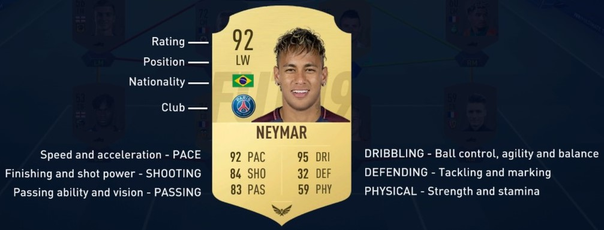
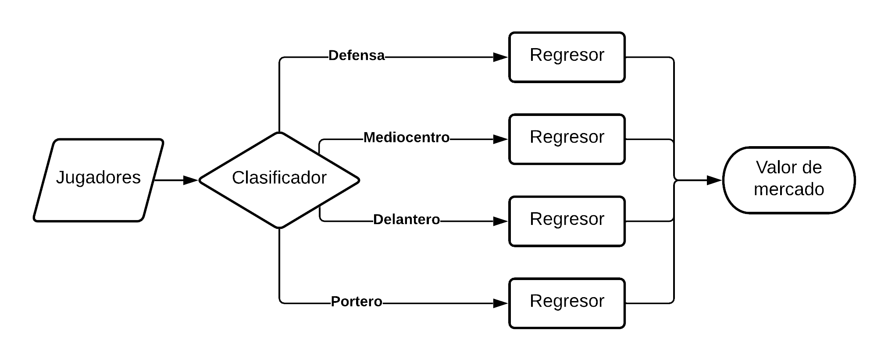

```{r setup, include=FALSE}
knitr::opts_chunk$set(echo = TRUE, message=FALSE, warning=FALSE)
options(repr.plot.width = 20, repr.plot.height = 20)
rm(list = ls())
```


```{r library}

# Cargamos las librerías necesarias:
library(dplyr)
library(kableExtra)
library(GGally)

library(corrplot)

library(stringr)
library(gridExtra)
library(ggplot2)
library(DMwR)
library(caret)
library(ResourceSelection)
library(pROC)

library(magrittr)
library(maps)
library(plotly)
library(DT)
library(factoextra)
library(tidyr)
library(tibble)

library(fitdistrplus)

```

```{r functions, message= FALSE, warning=FALSE}

# Creamos una serie de funciones para mejorar la visualización
my.head <- function(x, num=6){
  head(x, num) %>% 
    kable() %>% 
    kable_styling(bootstrap_options = c("striped", "condensed", "hover")) %>%
    scroll_box(width="100%",height="264px") # 72 + 32*rows
}

my.kable <- function(x){
  x %>%
    kable() %>% 
    kable_styling(bootstrap_options = c("striped", "condensed", "hover")) %>%
    scroll_box(width="100%",height="264px") # 72 + 32*rows
}

my.summary <- function(x){
  summary(x) %>%
    kable() %>% 
    kable_styling(bootstrap_options = c("striped", "condensed", "hover")) %>%
    scroll_box(width="100%",height=72 + 32*7) 
}

```

# Lectura del fichero

```{r LecFic}

# Leemos los jugadores
fifa <- read.csv("Data/players_20.csv", sep=",", header=TRUE, encoding = "UTF-8")

# Hacemos una primera visualización
my.head(fifa)

# Analizamos la estructura de las variables
str(fifa)

```


## Selección de registros

```{r create_League}

# Leemos los equipos
teams <- read.csv("Data/Fifa_Teams.csv", sep=";", header=TRUE)

# Juntamos los equipos con su liga
fifa <- merge(x=fifa,y=teams,by="club",all.x = TRUE)

# Mostramos las ligas seleccionadas
fifa %>%
  count(country, league, club) %>%
  count(country, league) %>%
  my.kable()

# Nos quedamos solo con los registros de las ligas cargadas
fifa %<>% filter(!is.na(league))

# Limpiamos la memória
rm(teams)

# Miramos los registros de cada liga
table(fifa$league)


```


## Añadimos Variables

### player_positions first

```{r create.player_positions.first}

# Analizamos player_positions
str(fifa$player_positions)
my.head(fifa$player_positions,20)

# Nos quedamos solo con la primera opción
fifa$player_positions.first <- factor(gsub(",","",substr(fifa$player_positions,1,3)))

# Resultado de player_positions.first
table(fifa$player_positions.first)

```

### player_positions class

```{r create.player_positions.class}

# Creamos las variables por zona
defence <- c("CB", "RB", "LB", "LWB", "RWB", "LCB", "RCB")
def.central <- c("CB", "LCB", "RCB")
def.lateral <- c("LB", "RB", "LWB", "RWB")

midfielder <- c("CM", "CDM","CAM","LM","RM", "LAM", "RAM", "LCM", "RCM", "LDM", "RDM")
midfielder.centro <- c("CM", "LCM", "RCM")
midfielder.ofensivo <- c("CAM", "LAM", "RAM")
midfielder.defensivo <- c("LDM", "RDM", "CDM")
midfielder.banda <- c("LM", "RM", "LW", "RW")

forward <- c("ST", "LW", "RW", "LF", "RF", "RS","LS", "CF")
forward.delantero <- c("ST", "LF", "RF", "RS","LS", "CF")

fifa %<>% 
  mutate(player_positions.class = if_else(player_positions.first %in% "GK", "Goal Keeper",
                                  if_else(player_positions.first %in% defence, "Defender",
                                  if_else(player_positions.first %in% midfielder, "Midfielder",
                                  if_else(player_positions.first %in% forward, "Forward", as.character(player_positions.first)))))
         )

fifa %<>% 
  mutate(player_positions.subclass = if_else(player_positions.first %in% "GK", "POR",
                                  if_else(player_positions.first %in% def.central, "DFC",
                                  if_else(player_positions.first %in% def.lateral, "LAT",
                                  if_else(player_positions.first %in% midfielder.centro, "MC",
                                  if_else(player_positions.first %in% midfielder.ofensivo, "MCO",
                                  if_else(player_positions.first %in% midfielder.defensivo, "MCD",
                                  if_else(player_positions.first %in% midfielder.banda, "BAN",
                                  if_else(player_positions.first %in% forward.delantero, "D", as.character(player_positions.first)))))))))
         )

fifa$value_eur.log <- log(fifa$value_eur)
# Limpiamos la memória
rm(defence, midfielder,forward)

# Resultado de player_positions.class
table(fifa$player_positions.class)

```

```{r}
# Resultado de player_positions.subclass
table(fifa$player_positions.subclass)
```


# Limpieza

## Valores Perdidos

```{r valoresPerdidos}

# Miramos que variables tienen valores perdidos
sort(colSums(is.na(fifa)), decreasing = TRUE)
sort(colSums(fifa==""), decreasing = TRUE)
sort(colSums(fifa==0), decreasing = TRUE)

# Eliminamos los datos que tengan vacíos alguno de los dos campos objetivo
fifa <- fifa %>% filter(value_eur != 0)
fifa <- fifa %>% filter(!is.na(value_eur))
```

## Valores Extremos

```{r boxplot}

gp1<- ggplot(fifa, aes(x=player_positions.class, y=age,       fill=player_positions.class)) + geom_boxplot() + theme(legend.position="none") + xlab("") 
gp2<- ggplot(fifa, aes(x=player_positions.class, y=overall,   fill=player_positions.class)) + geom_boxplot() + theme(legend.position="none") + xlab("") 
gp3<- ggplot(fifa, aes(x=player_positions.class, y=potential, fill=player_positions.class)) + geom_boxplot() + theme(legend.position="none") + xlab("") 
gp4<- ggplot(fifa, aes(x=player_positions.class, y=height_cm, fill=player_positions.class)) + geom_boxplot() + theme(legend.position="none") + xlab("") 
gp5<- ggplot(fifa, aes(x=player_positions.class, y=weight_kg, fill=player_positions.class)) + geom_boxplot() + theme(legend.position="none") + xlab("") 
gp6<- ggplot(fifa, aes(x=player_positions.class, y=value_eur, fill=player_positions.class)) + geom_boxplot() + theme(legend.position="none") + xlab("") 
gp7<- ggplot(fifa, aes(x=player_positions.class, y=wage_eur,  fill=player_positions.class)) + geom_boxplot() + theme(legend.position="none") + xlab("") 

grid.arrange(gp1, gp2, gp3, gp4, ncol = 2)
grid.arrange(gp5, gp6, gp7, ncol = 2)

# Limpiamos memoria
rm(gp1, gp2, gp3, gp4, gp5, gp6, gp7)

```


## Valores estadisticos

Las varibles que albergan las métricas que definen el rendimiento del jugador en el juego están acompañadas por un valor fijo y una cantidad variable que se suma a éste, para representar la evolución del jugador durante algunos modos de juego. Para este análisis nos quedaremos con la parte fija.

```{r estadisticas}
# select(Position, LS:RB)

# Pasamos las métricas de rendimiento nuevas a numéricas
for(i in 45:104) { # Iteramos sobre las métricas que queremos limpiar
  fifa[,i] <- as.numeric(substr(fifa[,i], 1, 2)) # Cogemos los dos primeros caracteres y convertimos a numeric

  # Calculamos las medias de la variable actual por player_positions.class
  media.ByClass <- aggregate(fifa[,i]~player_positions.class, fifa, median)

  # Por cada registro actualizamos las variables NA de esta class por la media calculada
  for (row in 1:nrow(media.ByClass)){
    fifa[fifa$player_positions.class==media.ByClass[row, "player_positions.class"] & is.na(fifa[,i]), i] <- as.numeric(media.ByClass[row, "fifa[, i]"])
  }
  # En caso de no encontrar valores para su grupo, ponemos la media de la variable
  fifa[is.na(fifa[,i]), i] <- as.numeric(mean(fifa[,i], na.rm = TRUE))
}

```


## Exportación de los datos preprocesados
Una vez limpiado nuestro conjunto de datos, guardamos el resultado en un nuevo fichero llamado fifa_2020_clean.csv:

```{r writeFile}
# Exportación de los datos limpios en .csv
write.csv(fifa, "Data/fifa_2020_clean.csv")
```


# Análisis exploratorio de los datos (EDA)

Definimos esta función que se usará para representar varias gráficas en la misma celda con la librería `ggplot2`.
```{r}
# Multiple plot function
#
# ggplot objects can be passed in ..., or to plotlist (as a list of ggplot objects)
# - cols:   Number of columns in layout
# - layout: A matrix specifying the layout. If present, 'cols' is ignored.
#
# If the layout is something like matrix(c(1,2,3,3), nrow=2, byrow=TRUE),
# then plot 1 will go in the upper left, 2 will go in the upper right, and
# 3 will go all the way across the bottom.
#
multiplot <- function(..., plotlist=NULL, file, cols=1, layout=NULL) {
  library(grid)

  # Make a list from the ... arguments and plotlist
  plots <- c(list(...), plotlist)

  numPlots = length(plots)

  # If layout is NULL, then use 'cols' to determine layout
  if (is.null(layout)) {
    # Make the panel
    # ncol: Number of columns of plots
    # nrow: Number of rows needed, calculated from # of cols
    layout <- matrix(seq(1, cols * ceiling(numPlots/cols)),
                    ncol = cols, nrow = ceiling(numPlots/cols))
  }

 if (numPlots==1) {
    print(plots[[1]])

  } else {
    # Set up the page
    grid.newpage()
    pushViewport(viewport(layout = grid.layout(nrow(layout), ncol(layout))))

    # Make each plot, in the correct location
    for (i in 1:numPlots) {
      # Get the i,j matrix positions of the regions that contain this subplot
      matchidx <- as.data.frame(which(layout == i, arr.ind = TRUE))

      print(plots[[i]], vp = viewport(layout.pos.row = matchidx$row,
                                      layout.pos.col = matchidx$col))
    }
  }
}
```

## Datos de partida
Los datos de partida en el EDA se encuentran en el *dataset* `fifa` resultado del proceso previo de limpieza.  

```{r}
# Visualizamos los datos de partida para el EDA
my.head(fifa)
```


Una vez planteados los objetivos analíticos, el primer paso del análisis exploratorio es estudiar la distribución de las variables predictoras y su dependencia con las variables a predecir. También resulta interesante observar la correlación entre variables predictoras.

## Variables objetivo
Las variables objetivo de este análisis son:

* El valor de mercado de los jugadores en euros: `value_eur`.
* La posición de los jugadores en el terreno de juego: `player_positions.class`.

Representamos a continuación las distribuciones de ambas magnitudes:

```{r}
ggplot(fifa, aes(x = value_eur, fill = "red")) + geom_density(alpha = 0.6) + theme(legend.position = "none")
```


```{r}
h1 <- ggplot(fifa, aes(x = player_positions.class, fill = player_positions.class)) + geom_bar() + theme(legend.position = "none")
h2 <- ggplot(fifa, aes(x = player_positions.subclass, fill = player_positions.class)) + geom_bar() + theme(legend.position = "none")

multiplot(h1, h2, cols=1)
```

La distribución del valor de mercado sigue una ley de distribución *Gamma* a simple vista.

```{r}
# En lugar de ajustar los valores en euros lo haremos en millones de euros:
x.gamma <- fifa$value_eur/10e6
fit.gamma <- fitdist(x.gamma, distr = "gamma")
summary(fit.gamma)

plot(fit.gamma)
```

(Los resultados de los ajustes los comentaremos en el documento PDF)

Influencia de la posición del jugador en el valor de mercado:

```{r}
ggplot(fifa, aes(x = value_eur, colour = player_positions.class)) + geom_density()
```

Parece existir una ligera influencia de la posición del jugador en valor de mercado. Si observamos la posición de los picos y la altura de la falda derecha de las distribuciones, nos daremos cuenta de que los delanteros tienden a ser más caros que los defensas.

## Edad, peso y altura
```{r}
h1 <- ggplot(fifa, aes(x = age, fill = "red")) + geom_density(alpha = 0.6) + theme(legend.position = "none")
h2 <- ggplot(fifa, aes(x = height_cm, fill = "red")) + geom_density(alpha = 0.6) + theme(legend.position = "none")
h3 <- ggplot(fifa, aes(x = weight_kg, fill = "red")) + geom_density(alpha = 0.6) + theme(legend.position = "none")

multiplot(h1, h2, h3, cols=1)

# Limpiamos la memória
rm(h1, h2, h3)

```

Podemos observar si existe dependencia entre estas variables y la posición del jugador:

```{r}
h1 <- ggplot(fifa, aes(x = age, colour = player_positions.class)) + geom_density() 
h2 <- ggplot(fifa, aes(x = height_cm, colour = player_positions.class)) + geom_density() 
h3 <- ggplot(fifa, aes(x = weight_kg, colour = player_positions.class)) + geom_density() 

multiplot(h1, h2, h3, cols=1)

# Limpiamos la memória
rm(h1, h2, h3)

```

* Edad: no se aprecian diferencias muy acuciantes entre las edades de cada grupo. Aunque existe una ligera tendencia entre los porteros a tener mayor edad. 
* Altura: en caso sí se observa que los porteros son signifcativamente más altos, y que los jugadores más bajos son los mediocentros.
* Peso: los porteros son significativamente más pesados.

En general, se observan diferencias entre las distribuciones de porteros, defensas, mediocentros y delanteros. Por tanto estas variables pueden resultar útiles para el análisis de la posición óptima de los jugadores.

Ahora vamos a ver la dependencia con la otra variable objetivo: el valor de mercado `value_eur`:

```{r}
h1 <- ggplot(fifa, aes(x=age, y=value_eur)) + geom_point()
h2 <- ggplot(fifa, aes(x=height_cm, y=value_eur)) + geom_point()
h3 <- ggplot(fifa, aes(x=weight_kg, y=value_eur)) + geom_point()

multiplot(h1, h2, h3, cols=1)

# Limpiamos la memória
rm(h1, h2, h3)

```

Como vemos, tanto el peso como la altura no parecen tener demasiada influencia en el valor del jugador. La edad tampoco tiene una influencia muy marcada, sin embargo si puede observarse una caída paulatina del precio cuando se superan los 32 años, también se puede ver que los jugadores jóvenes no llegan a su precio máximo hasta los 23. En la horquilla entre los 23 y los 32 años de edad el valor parece no tener una influencia grande.

Para terminar con esta terna de variables, podemos representar la correlación entre ellas y la correlación con el valor de mercado (al ser ésta una variable numérica):

```{r}
ggcorr(fifa[c(110,6,8,9)], label = TRUE, label_size = 2.9, hjust = 1, layout.exp = 2)
```

Como era de esperar por los resultados gráficos obtenidos, la edad, el peso y la altura no son buenos predictores del valor de mercado, por lo tanto no se incluirán en el análisis de la predicción de éste. Algo que se esperaba es la estrecha correlación entre la altura y el peso. La altura y el peso son dos variables que pueden influir en la posición del jugador, como se ha observado en los gráficos, pero al estar tan estrechamente correlacionadas la mejor opción puede ser tomar una sola para el análisis de la posición.

## Habilidades básicas

Las habilidades son las variables que más influencia se espera que tengan en la predicción tanto de la posición del jugador como de su valor de mercado.

En el juego un jugador está representado por 6 habilidades básicas. Que son `pace`,`shooting`, `passing`, `dribbling`, `defending` y `physical`. 



Para hacer un análisis exploratorio más significativo y adaptado a nuestro objetivo, representaremos cada una de estas habilidades sobre cada una de las tres clases de posiciones: defensores (`Defender`), mediocampistas (`Midfielder`) y atacantes (`Forward`):

```{r message= FALSE, warning=FALSE}
library(ggplot2)

d1 <- ggplot(fifa, aes(x = pace, colour = player_positions.class)) + geom_density()
d2 <- ggplot(fifa, aes(x = shooting, colour = player_positions.class)) + geom_density()
d3 <- ggplot(fifa, aes(x = passing, colour = player_positions.class)) + geom_density()

multiplot(d1, d2, d3, cols=1)

# Limpiamos la memória
rm(d1, d2, d3)

```

```{r}
d4 <- ggplot(fifa, aes(x = dribbling, colour = player_positions.class)) + geom_density()
d5 <- ggplot(fifa, aes(x = defending, colour = player_positions.class)) + geom_density()
d6 <- ggplot(fifa, aes(x = physic, colour = player_positions.class)) + geom_density()

multiplot(d4, d5, d6, cols=1)

# Limpiamos la memória
rm(d4, d5, d6)

```

Se puede observar la diferencia en las distribuciones entre cada una de las tres posiciones. A continuación se calcula la media de cada una de las distribuciones anteriores:

```{r}
pace <- c(mean(fifa$pace[fifa$player_positions.class == "Defender"]),
           mean(fifa$pace[fifa$player_positions.class == "Midfielder"]),
           mean(fifa$pace[fifa$player_positions.class == "Forward"]))

shooting <- c(mean(fifa$shooting[fifa$player_positions.class == "Defender"]),
           mean(fifa$shooting[fifa$player_positions.class == "Midfielder"]),
           mean(fifa$shooting[fifa$player_positions.class == "Forward"]))

passing <- c(mean(fifa$passing[fifa$player_positions.class == "Defender"]),
           mean(fifa$passing[fifa$player_positions.class == "Midfielder"]),
           mean(fifa$passing[fifa$player_positions.class == "Forward"]))

dribbling <- c(mean(fifa$dribbling[fifa$player_positions.class == "Defender"]),
           mean(fifa$dribbling[fifa$player_positions.class == "Midfielder"]),
           mean(fifa$dribbling[fifa$player_positions.class == "Forward"]))

defending <- c(mean(fifa$defending[fifa$player_positions.class == "Defender"]),
           mean(fifa$defending[fifa$player_positions.class == "Midfielder"]),
           mean(fifa$defending[fifa$player_positions.class == "Forward"]))

physic <- c(mean(fifa$physic[fifa$player_positions.class == "Defender"]),
           mean(fifa$physic[fifa$player_positions.class == "Midfielder"]),
           mean(fifa$physic[fifa$player_positions.class == "Forward"]))

positions <- c("Defender", "Midfielder", "Forward")

means <- data.frame(positions, pace, shooting, passing, dribbling, defending, physic)
my.head(means)


# Otra manera de hacerlo
pace <-      aggregate(fifa$pace~player_positions.class, fifa, mean)
shooting <-  aggregate(fifa$shooting~player_positions.class, fifa, mean)
passing <-   aggregate(fifa$passing~player_positions.class, fifa, mean)
dribbling <- aggregate(fifa$dribbling~player_positions.class, fifa, mean)
defending <- aggregate(fifa$defending~player_positions.class, fifa, mean)
physic <-    aggregate(fifa$physic~player_positions.class, fifa, mean)

means <- data.frame(pace[1], pace[2], shooting[2], passing[2], dribbling[2], defending[2], physic[2])
my.head(means)


# Limpiamos la memória
rm(pace, shooting, passing, dribbling, defending, physic)


```

Y las desviaciones estándar:

```{r}
pace <- c(sd(fifa$pace[fifa$player_positions.class == "Defender"]),
           sd(fifa$pace[fifa$player_positions.class == "Midfielder"]),
           sd(fifa$pace[fifa$player_positions.class == "Forward"]))

shooting <- c(sd(fifa$shooting[fifa$player_positions.class == "Defender"]),
           sd(fifa$shooting[fifa$player_positions.class == "Midfielder"]),
           sd(fifa$shooting[fifa$player_positions.class == "Forward"]))

passing <- c(sd(fifa$passing[fifa$player_positions.class == "Defender"]),
           sd(fifa$passing[fifa$player_positions.class == "Midfielder"]),
           sd(fifa$passing[fifa$player_positions.class == "Forward"]))

dribbling <- c(sd(fifa$dribbling[fifa$player_positions.class == "Defender"]),
           sd(fifa$dribbling[fifa$player_positions.class == "Midfielder"]),
           sd(fifa$dribbling[fifa$player_positions.class == "Forward"]))

defending <- c(sd(fifa$defending[fifa$player_positions.class == "Defender"]),
           sd(fifa$defending[fifa$player_positions.class == "Midfielder"]),
           sd(fifa$defending[fifa$player_positions.class == "Forward"]))

physic <- c(sd(fifa$physic[fifa$player_positions.class == "Defender"]),
           sd(fifa$physic[fifa$player_positions.class == "Midfielder"]),
           sd(fifa$physic[fifa$player_positions.class == "Forward"]))

positions <- c("Defender", "Midfielder", "Forward")

sdevs <- data.frame(positions, pace, shooting, passing, dribbling, defending, physic)
my.head(sdevs)


# Otra manera de hacerlo
pace <-      aggregate(fifa$pace~player_positions.class, fifa, sd)
shooting <-  aggregate(fifa$shooting~player_positions.class, fifa, sd)
passing <-   aggregate(fifa$passing~player_positions.class, fifa, sd)
dribbling <- aggregate(fifa$dribbling~player_positions.class, fifa, sd)
defending <- aggregate(fifa$defending~player_positions.class, fifa, sd)
physic <-    aggregate(fifa$physic~player_positions.class, fifa, sd)

sdevs <- data.frame(pace[1], pace[2], shooting[2], passing[2], dribbling[2], defending[2], physic[2])
my.head(sdevs)

# Limpiamos la memória
rm(pace, shooting, passing, dribbling, defending, physic)


```

En la tabla de medias podemos apreciar en forma numérica las diferencias que se visualizaban en las gráficas anteriores. Podemos concluir que las seis habilidades básicas son buenas predictoras de la posición del jugador y por tanto deben estar presentes en el modelo de clasificación.

En cuanto a la dependencia de éstas con el valor de mercado del jugador:

```{r}
h1 <- ggplot(fifa, aes(x=pace, y=value_eur.log)) + geom_point()
h2 <- ggplot(fifa, aes(x=shooting, y=value_eur.log)) + geom_point()
h3 <- ggplot(fifa, aes(x=passing, y=value_eur.log)) + geom_point()

multiplot(h1, h2, h3, cols=1)
```

```{r}
h1 <- ggplot(fifa, aes(x=dribbling, y=value_eur.log)) + geom_point()
h2 <- ggplot(fifa, aes(x=defending, y=value_eur.log)) + geom_point()
h3 <- ggplot(fifa, aes(x=physic, y=value_eur.log)) + geom_point()

multiplot(h1, h2, h3, cols=1)
```

Observamos cierta relación entre cada una de las habilidades y el valor del jugador. Especialmente en las habilidades de atacante, que suelen ser los jugadores más cotizados. Sin embargo la correlación no es todo lo clara que podría esperarse, hay variables donde ni siquiera se observa relación alguna. Esto ocurre porque una habilidad por sí sola no hace a un jugador más caro o barato, si no el conjunto de ellas.

Para observar este fenómenos representaremos el `overall rating` y el `potential` en función del valor de mercado:

```{r}
h1 <- ggplot(fifa, aes(x=overall, y=value_eur.log)) + geom_point()
h2 <- ggplot(fifa, aes(x=potential, y=value_eur.log)) + geom_point()

multiplot(h1, h2, cols = 1)
```

Para cuantificar todas estas dependencias, calculamos los coeficientes de correlación entre cada una de las habilidades y el valor de mercado, incluyendo el `overall`:

```{r}
ggcorr(fifa[c(110,11,12,32,33,34,35,36,37)], label = TRUE, label_size = 2.9, hjust = 1, layout.exp = 2)
```

Vemos la fuerte dependencia entre el `overall` y el valor de mercado. Dados estos resultados, para el estudio del valor de mercado se usaría el `overall` y las variables `pace`, `shooting`, `passing` y `dribbling`. Se excluirían del análisis `defending` y `physic` por presentar una correlación con la variable objetivo menor a 0.2. Por otra parte, hay que tener en cuenta que estamos analizando en el mismo conjunto a los delanteros y a los defensas y mediocentros. ¿Cambiarían estos coeficientes si los representamos por separado para cada posición?

```{r}

fifa.gk  <- fifa %>% filter(player_positions.class == "Goal Keeper")
fifa.def <- fifa %>% filter(player_positions.class == "Defender")
fifa.mid <- fifa %>% filter(player_positions.class == "Midfielder")
fifa.for <- fifa %>% filter(player_positions.class == "Forward")

h1 <- ggcorr( fifa.gk[c(110,11,12,32,33,34,35,36,37)], label = TRUE, label_size = 3, hjust = 1, layout.exp = 2)
h2 <- ggcorr(fifa.def[c(110,11,12,32,33,34,35,36,37)], label = TRUE, label_size = 3, hjust = 1, layout.exp = 2)
h3 <- ggcorr(fifa.mid[c(110,11,12,32,33,34,35,36,37)], label = TRUE, label_size = 3, hjust = 1, layout.exp = 2)
h4 <- ggcorr(fifa.for[c(110,11,12,32,33,34,35,36,37)], label = TRUE, label_size = 3, hjust = 1, layout.exp = 2)

multiplot(h1, h2, h3, h4, cols = 2)

# Limpiamos la memória
rm(h1, h2, h3, h4)

```


Vemos como las habilidades que son importantes para el valor en los defensas (`defending` y `physic`), no lo son para los delanteros, y viceversa. Entonces, ¿qué variables seleccionamos para el análisis? 

Recordamos que tenemos dos objetivos analíticos:

* Predecir el valor de mercado mediante regresión.
* Clasificar cada jugador en su posición óptima.

El valor de mercado depende de la posición (y de otras variables) pero la posición no depende del valor de mercado. Entonces a la hora de construir nuestro *pipeline*, lo correcto es colocar el clasificador en primera línea y aplicar la regresión por separado a defensas, mediocentros y delanteros, así podremos seleccionar las mejores variables predictoras en cada caso.

En resumen, en lugar de realizar la regresión sobre el conjunto total de jugadores y dejar en manos de un algoritmo la selección de las variables predictoras más importantes, aprovechamos que conocemos de antemano las variables más determinantes para cada posición y aplicamos la regresión por separado personalizando más el análisis a cada tipo de jugador.



## Habilidades extra
Si observamos el *dataset* podemos ver que estas seis no son las únicas variables que el juego utiliza para caracterizar a cada jugador. Existe una larga lista de variables adicionales, unas 60. Sin embargo, para evitar saturar el problema de regresión, intentaremos reducir esas 60 variables a 5 mediante métodos de reducción de la dimensionalidad como *PCA*.

```{r}
# Hacemos un PCA para seleccionar unas pocas variables de entre las 59 habilidades extra
library(FactoMineR)
pca.45_104 <- PCA(X = fifa[45:104], scale.unit = FALSE, graph = FALSE)
fviz_screeplot(pca.45_104, addlabels = TRUE, ylim = c(0, 100))
```

Observamos como de las 59 variables, hemos encontrado 3 que explican el 85.4% de la varianza. Esas tres componentes no son componentes existentes en el *dataset* sino que cada una es una combinación lineal de todas ellas. El método PCA nos ha permitido pasar de un espacio de 59 dimensiones a uno de 3, y únicamente estamos perdiendo un 14,6% de varianza.

Vamos a extraer la representación de cada instancia del *dataset* en base a esas tres variables:

```{r}
# Representación de las observaciones con respecto a las dos primeras componentes con la posición.class
fviz_pca_ind(pca.45_104, geom.ind = "point", 
             col.ind = fifa$player_positions.class,
             pch = 16,
             addEllipses=TRUE, ellipse.level=0.95,
             axes = c(1, 2), 
             pointsize = 1.5) 
```

```{r}
# Representación de las observaciones con respecto a las dos primeras componentes con el logaritmo del valor
fviz_pca_ind(pca.45_104, geom.ind = "point", 
             col.ind = fifa$value_eur.log,
             palette = "viridis",
             pch = 16,
             axes = c(1, 2), 
             pointsize = 1.5) 
```

Se observa un cierto gradiente de color que inidica que quizás pueda existir correlación entre estas componentes y el valor (en escala logarítmica).

```{r}
my.head(pca.45_104$ind$coord[,1:3])
```


```{r}
# Representación gráfica en 3 dimensiones de las tres primeras componentes junto con la posición.class
#install.packages("scatterplot3d") # Install
library("scatterplot3d") # load
colors <- c("brown1", "chartreuse", "magenta", "deepskyblue3")
colors <- colors[as.factor(fifa$player_positions.class)]
scatterplot3d(pca.45_104$ind$coord[,1:3], angle = 115, pch = 16, color= colors, box = FALSE)
legend("top", legend = levels(as.factor(fifa$player_positions.class)),
      col = c("brown1", "chartreuse", "magenta", "deepskyblue3"), pch = 16, bg = "transparent", 
      inset = -0.2, xpd = TRUE, horiz = TRUE)
```

```{r}
# Representación de las tres primeras componentes junto con la posición.subclass
colors <- c("brown1", "chartreuse", "magenta", "deepskyblue3", "gold", "burlywood4", "forestgreen", "cadetblue1")
colors <- colors[as.factor(fifa$player_positions.subclass)]
scatterplot3d(pca.45_104$ind$coord[,1:3], angle = 115, pch = 16, color= colors, box = FALSE)
legend("top", legend = levels(as.factor(fifa$player_positions.subclass)),
      col = c("brown1", "chartreuse", "magenta", "deepskyblue3", "gold", "burlywood4", "forestgreen", "cadetblue1"), pch = 16, bg = "transparent", 
      inset = -0.2, xpd = TRUE, horiz = TRUE)
```


Observamos como las cuatro posiciones fundamentales constituyen cada una un *clúster* en el gráfico. Es por ello que se prevee que las tres primeras componentes extraídas del PCA sean buenos clasificadores. Para poder usarlos en los modelos posteriores, vamos a añadirlas al dataset:

```{r}
fifa$PC1 <- pca.45_104$ind$coord[,1]
fifa$PC2 <- pca.45_104$ind$coord[,2]
fifa$PC3 <- pca.45_104$ind$coord[,3]
```

Ahora se encuentran al final del *dataset*.

# Modelos de regresión

```{r}
# Seleccionamos el juego de datos
#fifa.mod <- fifa.def
#fifa.mod <- fifa.mid
#fifa.mod <- fifa.for
fifa.mod <- fifa

fifa.mod$value_eur <- fifa.mod$value_eur / 1000000

## set the seed to make your partition reproducible
set.seed(123)
test_ind <- sample(seq_len(nrow(fifa.mod)), size = floor(0.25 * nrow(fifa.mod)))
fifa.mod.Train <- fifa.mod[-test_ind, ]
fifa.mod.Test <- fifa.mod[test_ind, ]


# Defender
mod_Defender_1 <- lm(value_eur.log ~ overall	+ potential + defending, data = fifa.mod.Train)
mod_Defender_2 <- lm(value_eur.log ~ overall	+ potential + defending	+ physic, data = fifa.mod.Train)
# Midfielder
mod_Midfielder_1 <- lm(value_eur.log ~ overall	+ potential + passing	+ dribbling + shooting, data = fifa.mod.Train)
mod_Midfielder_2 <- lm(value_eur.log ~ overall	+ potential + passing	+ dribbling, data = fifa.mod.Train)
mod_Midfielder_3 <- lm(value_eur.log ~ overall	+ potential + passing, data = fifa.mod.Train)
# Forward
mod_Forward_1 <- lm(value_eur.log ~ overall	+ potential+ shooting + dribbling, data = fifa.mod.Train)
mod_Forward_2 <- lm(value_eur.log ~ overall	+ potential+ shooting, data = fifa.mod.Train)
mod_Forward_3 <- lm(value_eur.log ~ overall	+ potential+ dribbling, data = fifa.mod.Train)


# Tabla con los coeficientes de determinación de cada modelo
tabla.coeficientes <- matrix(c('mod_Defender_1', summary(mod_Defender_1)$r.squared,sqrt(deviance(mod_Defender_1)/df.residual(mod_Defender_1)),
                               'mod_Defender_2', summary(mod_Defender_2)$r.squared,sqrt(deviance(mod_Defender_2)/df.residual(mod_Forward_2)),
                               'mod_Midfielder_1', summary(mod_Midfielder_1)$r.squared,sqrt(deviance(mod_Midfielder_1)/df.residual(mod_Midfielder_1)),
                               'mod_Midfielder_2', summary(mod_Midfielder_2)$r.squared,sqrt(deviance(mod_Midfielder_2)/df.residual(mod_Midfielder_2)),
                               'mod_Midfielder_3', summary(mod_Midfielder_3)$r.squared,sqrt(deviance(mod_Midfielder_3)/df.residual(mod_Midfielder_3)),
                               'mod_Forward_1', summary(mod_Forward_1)$r.squared,sqrt(deviance(mod_Forward_1)/df.residual(mod_Forward_1)),
                               'mod_Forward_2', summary(mod_Forward_2)$r.squared,sqrt(deviance(mod_Forward_2)/df.residual(mod_Forward_2)),
                               'mod_Forward_3', summary(mod_Forward_3)$r.squared,sqrt(deviance(mod_Forward_3)/df.residual(mod_Forward_2))
                            ),ncol = 3, byrow = TRUE)
colnames(tabla.coeficientes) <- c("Modelo", "R^2", "Residual standard error")
tabla.coeficientes

# Creamos las predicciones para los modelos
pred_Defender_1 <- predict(mod_Defender_1, fifa.mod.Test)
pred_Defender_2 <- predict(mod_Defender_2, fifa.mod.Test)
pred_Midfielder_1 <- predict(mod_Midfielder_1, fifa.mod.Test)
pred_Midfielder_2 <- predict(mod_Midfielder_2, fifa.mod.Test)
pred_Midfielder_3 <- predict(mod_Midfielder_3, fifa.mod.Test)
pred_Forward_1 <- predict(mod_Forward_1, fifa.mod.Test)
pred_Forward_2 <- predict(mod_Forward_2, fifa.mod.Test)
pred_Forward_3 <- predict(mod_Forward_3, fifa.mod.Test)

# Mostramos los resultados
df <- data.frame(Original=fifa.mod.Test$value_eur,
                 pred_Defender_1=pred_Defender_1,
                 pred_Defender_2=pred_Defender_2,
                 pred_Midfielder_1=pred_Midfielder_1,
                 pred_Midfielder_2=pred_Midfielder_2,
                 pred_Midfielder_3=pred_Midfielder_3,
                 pred_Forward_1=pred_Forward_1,
                 pred_Forward_2=pred_Forward_2,
                 pred_Forward_3=pred_Forward_3)
df


```


```{r}
fifa.mod <- fifa

fifa.mod$value_eur <- fifa.mod$value_eur / 1000000

## set the seed to make your partition reproducible
set.seed(123)
test_ind <- sample(seq_len(nrow(fifa.mod)), size = floor(0.25 * nrow(fifa.mod)))
fifa.mod.Train <- fifa.mod[-test_ind, ]
fifa.mod.Test <- fifa.mod[test_ind, ]


mod_overall <- lm(overall ~ age + value_eur + potential + wage_eur, data = fifa.mod.Train)


# Tabla con los coeficientes de determinación de cada modelo
tabla.coeficientes <- matrix(c('mod_overall', summary(mod_overall)$r.squared,sqrt(deviance(mod_overall)/df.residual(mod_overall))
                            ),ncol = 3, byrow = TRUE)
colnames(tabla.coeficientes) <- c("Modelo", "R^2", "Residual standard error")
tabla.coeficientes

# Creamos las predicciones para los modelos
pred_mod_overall <- predict(mod_overall, fifa.mod.Test)

# Mostramos los resultados
df <- data.frame(Original=fifa.mod.Test$overall,
                 pred_mod_overall=pred_mod_overall)
df


```
